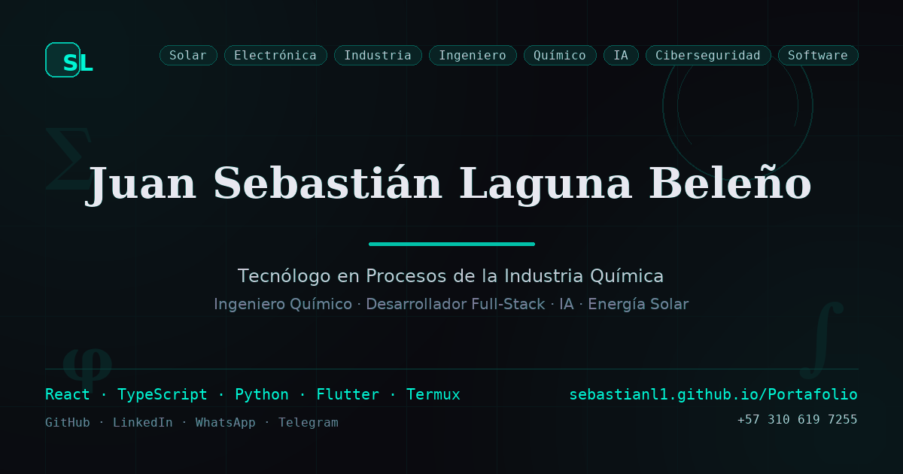

# Portafolio — Sebastián Laguna

<p align="center">
  
</p>

Portafolio personal de **Juan Sebastián Laguna Beleño** — Tecnólogo en Procesos
de la Industria Química, estudiante de Ingeniería Química, desarrollador
full-stack, ciberseguridad y sistemas.

> **Sitio en vivo:** <https://sebastianl1.github.io/Portafolio/>

## Secciones

- **Hero** — Presentación con red social flotante.
- **Formación** — Estudios técnicos y profesionales con competencias.
- **Proyectos** — Tarjetas con captura, enlaces a la landing y al repositorio,
  y modal de vista previa (iframe).
- **Skills** — Áreas de conocimiento por dominio.
- **Contacto** — GitHub, LinkedIn, WhatsApp y email.

## Stack

| Capa        | Tecnología          |
| ----------- | ------------------- |
| Framework   | React 19            |
| Lenguaje    | TypeScript 5.7      |
| Bundler     | Vite 6              |
| Estilos     | CSS vanilla + variables |
| i18n        | Español / English (toggle) |
| Despliegue  | GitHub Pages (rama `gh-pages`) |

## Ejecutar localmente

```bash
npm install
npm run dev        # servidor de desarrollo
```

## Build y deploy

```bash
npm run build      # tsc -b && vite build -> dist/
npm run deploy     # publica dist/ a la rama gh-pages
```

## Estructura

```
portfolio/
├── public/
│   ├── projects/          # Capturas de proyectos
│   ├── certificates/      # PDFs de certificados
│   ├── og-image.png       # Imagen Open Graph
│   ├── robots.txt / sitemap.xml / llms.txt
│   └── manifest.json      # PWA
├── src/
│   ├── components/        # ui/, layout/, sections/, SocialFloating
│   ├── contexts/          # LanguageContext, ThemeContext
│   ├── data/              # profile, skills, projects, courses
│   ├── hooks/             # useScrollReveal, useMediaQuery
│   ├── i18n/              # translations.ts (EN/ES)
│   ├── styles/            # animations.css
│   └── types/             # portfolio.ts
├── docs/                  # Documentación interna (CONTEXT, CODE-REFERENCE)
├── index.html             # SEO/AEO: meta, og, JSON-LD (Person + ItemList)
└── vite.config.ts         # base '/Portafolio/'
```

## Proyectos destacados

- **RANDI** — Asistente de IA local para Termux (LLMs con Ollama y WebGPU).
- **Antigravity CLI para Termux** — Instalador nativo del agente de IA de Google.
- **OpenCode para Termux** — Instalador nativo de la terminal de IA OpenCode.
- **Claude Code para Termux** — Instalador nativo de la terminal de IA de Anthropic.
- **SCADA SPy** · **Proccesф (P&ID/HMI)** · **FractaLab** — Automatización industrial, caos y matemáticas.

## Contacto

- GitHub: <https://github.com/sebastianl1>
- LinkedIn: <https://www.linkedin.com/in/juan-sebastian-laguna-bele%C3%B1o-0a22bb363>

## Licencia

MIT
